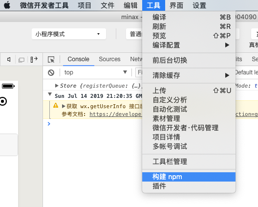
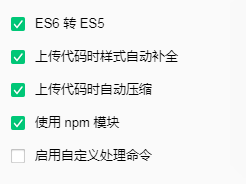

# Minax是什么？
Minax是一个专为小程序开发的状态管理库，它采用集中式存储管理应用的所有组件的状态，
并能够配置是否与缓存做绑定，使用方式类似与Vuex。通常可以用来解决多个试图共享同一
状态或者多个试图需要变更同一状态的场景。
## 我们的优势
 * 全局状态state支持App、Page、Component、Behavior（这一点强于市面上其他的库）
 * 使用方式类似于Vuex，有相关经验的同学上手会比较容易
 * 代码侵入小，集成简单，不需要在每个页面调用getApp(),直接this.$store....
 * 支持与缓存无感知绑定(可选项)，从此与Storage说拜拜
# 小程序支持情况
> 得益于各个小程序提供平台的相互借鉴，使得我们的库能够支持几乎市面上所有的小程序
>（您只需要在集成本库后做少量修改），本文档锁涉及案例均以微信小程序为例
+ 微信小程序
+ 支付宝小程序
+ 百度小程序
+ 京东小程序
+ 头条小程序
# 安装
> 以微信小程序威力，小程序从基础库2.2.1开始支持npm，
>[文档链接](https://developers.weixin.qq.com/miniprogram/dev/devtools/npm.html), 使用该插件时建议将您的版本升至2.2.1以上
### 2.2.1以下版本引入方式
针对2.2.1以下基础库版本，请将本库的dist目录复制到您的项目中，然后适用require或者import的方式引用即
```javascript
var Store = require('../dist/index.js') // 具体的路径根据您的文件目录做调整
```
或者
```javascript
import Store from '../dist/index.js' // 具体的路径根据您的文件目录做调整
```
### 2.2.1及以上版本库的引入方式
由于小程序的文件夹默认不采用npm的形式，所以第一步需要将小程序项目初始化成npm项目
```bash
npm init
```
然后根据你的包管理工具使用
```bash
npm install --save minax
```
或者
```bash
yarn add minax
```
安装成功后，点击开发者工具中的菜单栏：工具 --> 构建 npm 


勾选“使用 npm 模块”选项： 



构建完成后即可使用 npm 包,js 中引入 npm 包：
```javascript
const Store = require('minax')
```
# 开始
Minax库的核心就是store（仓库）。“store”基本上就是一个容器，它包含着你的应用中大部分的状态 (state以及action)。

Minax 和单纯的全局对象有以下两点不同：

Minax 的状态存储是基于发布订阅模式的，当页面或组件从 中设置了 mapState 时，相当于向store订阅了该状态，若 store 中的状态发生变化，那么相应的组件、页面也会相应地得到高效更新。

你不能直接改变 store 中的状态，改变 store 中的状态的唯一途径就是显式地提交发布 (commit)，这样使得我们可以方便地跟踪每一个状态的变化。

## 一个简单的store
我们建议在项目建一个store/index.js文件，一个简单的store编写如下：
```javascript
import Store from '../dist/index.js'

const store = new Store({
  state: {
    cartCount: 0,
    mark: ''
  },
  action: {
    setmark({commit}, payload) {
      setTimeout(() => {
        commit('mark', payload)
      }, 2000) 
    }
  }
})
export default store
```
现在，你可以通过 store.state 来获取状态对象，以及通过 store.commit 方法触发状态变更：
```javascript
store.commit('mark', '这是一条备注信息')

console.log(store.state.mark) // -> '这是一条备注信息'
```

在项目的app.js中，将store引入
```javascript
import store from './store/index.js'
store.install()
```
在Page、Component、Behavior中配置mapState属性，其对应的值为一个字符串或者字符串数组
mapState: ['cartCount', 'mark'],
或者
mapState: 'cartCount'，经mapState处理过的属性等效于设置月data中，您可以通过this.data.cartCount获取，也可以通过this.$store.state.cartCount获取
```javascript
Page({
  data: {
    info: '我是首页'
  },
  mapState: ['cartCount', 'mark'],
  onLoad: function() {
    // 数量加1
    this.$store.commit('mark', '这是一条备注信息')
    this.$store.dispatch('setmark', '这是一条由action触发的备注信息')
  }
})
```
在wxml中，直接绑定改值既可
```xml
<view class="mark">备注：{{mark}}</view>
```
看到这里，你应该已经基本掌握本库的使用了

## 相关构造参数
### state
state是Minax的全部状态源，我们通过在state中设置的key来绑定状态，其有两个特性：
1. 每个key对应一个状态，这些状态最终通过mapState混入到页面或组件的data中，所以其值和data中的值准遵循同样的规则
2. 这里的key会作为commit的type使用，例如store.commit(key, payload)
```javascript
new Store({
    state: {
         mark: 'default'   
    }
})
```

### bindStorageMode
Minax支持于缓存绑定的模式，这一点你只需要知道即可，因为你无需操作缓存，这一切都由store帮你做好，初始化时会自动读取，更新时会自动写入，而你要做的知识在bindStorageMode等于true时，配置state的持久化属性即可
```javascript
export default new Store({
  // 绑定缓存模式时，state入参不太一样
  bindStorageMode: true,
  state: {
    cartCount: {
      persistence: true,
      default: 0 // 真正的值在这里
    },
    mark: {
      persistence: true,
      default: ''
    }
  }
})
```
### action
action通常用于处理异步事物（你实在要同步使用我也没办法）
> PS：另一个能用到action的地方是，当你希望设置某个全局方法，并用其更新状态时
```javascript
import Store from '../dist/index.js'

export default new Store({
   action: {
     setmark({commit}, payload) {
       setTimeout(() => {
         commit('mark', payload)
       }, 2000) 
     }
   }
})
```
使用时
```javascript
this.$store.dispatch('setmark')
```
好啦，暂时先到这里，你可以愉快的coding啦

